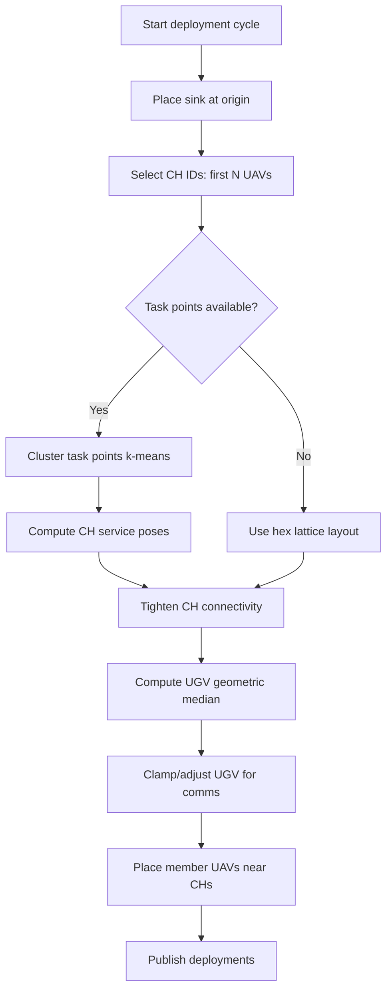
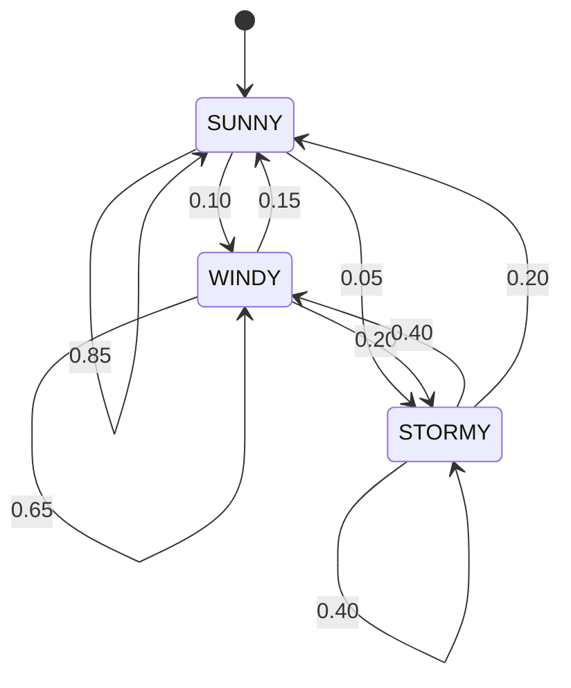

# FANET-Based UAV–UGV Cooperative Monitoring System (Flood / Disaster Scenarios)

## Overview

This project implements a **fully simulated FANET (Flying Ad‑hoc Network)** for **UAV–UGV cooperative monitoring in disaster and flood scenarios**, with a strong focus on **network robustness, routing under mobility, charging logistics, and weather‑induced failures**.

All network behavior (routing, buffering, drops, acknowledgements) is **explicitly modeled at application level**, enabling precise QoS measurement and reproducible experiments.

The project is structured to support:

* Highly mobile UAV swarms
* Dynamic network partitioning
* Store–carry–forward routing
* Energy‑aware charging via UGVs
* Weather‑driven network instability
* End‑to‑end QoS evaluation

---

## Key Concepts

### 1. FANET Network Abstraction

All packets (DATA and CONTROL) are routed through a **logical FANET bus**:

* `/fanet/network_bus_raw` – packets before impairment
* `/fanet/network_bus` – packets after fault injection
* `/fanet/delivered` – authoritative delivery events

This separation allows us to **inject failures without modifying node logic** and to **measure true end‑to‑end performance**.

---

### 1.1 Deployment Point Computation (Coverage Planner)

The **coverage planner** computes deployment targets for the sink, UGV, cluster heads (CHs), and member UAVs during the initial deployment cycle:

1. **Sink placement** is fixed at the origin `(0, 0)` on first deployment.
2. **CH placement** follows a task-driven layout:
   * Task points are clustered (k‑means style) into `num_ch` clusters.
   * Each cluster head target is moved toward the farthest task until all tasks fit within the CH service radius.
3. **Fallback CH layout** (if task clustering fails) uses a **hexagonal lattice** centered at the origin, with greedy assignment to nearest available lattice points.
4. **Connectivity tightening** post-processes CH targets:
   * Pulls CHs toward task anchors,
   * Ensures overlap between nearest neighbors,
   * Keeps at least one CH within comms radius of the sink,
   * Clamps positions to the configured area bounds.
5. **UGV placement** is the geometric median of CH positions (Weiszfeld-style iteration), clamped to bounds, and nudged closer if it falls outside comms range.
6. **Member placement** assigns each member UAV near its CH with a random polar offset within a bounded radius, clamped to bounds.



---

### 2. Routing Model (No Global Knowledge)

Each UAV performs:

* Local neighbor discovery
* Greedy next‑hop selection
* Charging‑aware routing penalty
* Loop guard + TTL enforcement
* Store–carry–forward buffering

---

### 3. Roles in the System

* **Member UAVs**
  Perform area scanning and generate search telemetry when reaching task points.

* **Cluster‑Head (CH) UAVs**
  Act as aggregation and relay nodes; may temporarily disconnect from the backbone.

* **UGV Charger**
  Provides charging service; charging requests and decisions are routed through the FANET.

* **Sink Gateway**
  Collects all delivered data and control packets.

---

### 4. Charging Protocol Evaluation

Charging is treated as a **networked control problem**:

* `ChargeRequest` and `ChargeDecision` packets are routed like any other traffic
* Decisions may be delayed, dropped, or arrive too late
* Charging success depends on **both network QoS and energy state**

The system records:

* Request acceptance / rejection
* Timeouts and drops
* Docking success
* Charging latency

This enables **direct comparison of charging policies under network stress**.

---

### 5. Weather‑Driven Fault Injection

A dedicated **fault injector** models packet drops as a function of:

* Wind intensity
* Rain intensity
* Temperature deviation

Drops affect:

* Data traffic
* Control traffic (with configurable attenuation)

This allows controlled experiments on **network resilience under adverse environmental conditions**.

The weather node steps through a **three‑state Markov regime model** (SUNNY, WINDY, STORMY) with the following transition probabilities:



---

## Architecture

```
+-------------------+
| Weather Node      |
+---------+---------+
          |
          v
+-------------------+       
| Fault Injector    |
+---------+---------+       
          |
          v
+-------------------+        +---------------------+
| FANET Raw Bus (In)|<------ | UAV / UGV / Sink    |
+---------+---------+        +---------------------+
          |
          v
+-------------------+        +---------------------+
| FANET Bus(Out)|------> | UAV / UGV / Sink    |
+-------------------+        +---------------------+
                                        |
                                        v
                             +---------------------+
                             | Delivered Channel   |
                             +---------------------+
                                        |
                                        v
                             +-------------------+
                             | Network Monitor   |
                             +-------------------+
```

---

## Metrics & Logging (Step F)

The system automatically records **experiment‑ready metrics**:

### Per‑Message (`messages.csv`)

* End‑to‑end delay
* Hop count / forwarding overhead
* Delivery or drop reason
* Loop / TTL / weather drops

### Charging Events (`charge_events.csv`)

* Success vs failure
* Decision latency
* Failure causes (drop, timeout, energy)

### UAV State Time Series (`status_timeseries.csv`)

* Battery level
* Charging state
* Backbone participation
* Position over time

### Run Summary (`summary.json`)

* PDR by traffic type
* Delay statistics (mean / p95)
* Drop breakdown
* Charging success rate

All outputs are written to:

```
<output_dir>/<run_id>/
```

---

## System Bringup

The entire system is launched via the **`system_bringup` package**.

### Example

```bash
ros2 launch system_bringup experiment.launch.py \
  config:=system_bringup/config/runs/example_run.yaml \
  run_id:=demo_weather_high \
  output_dir:=/tmp/fanet_logs
```

---

## Reproducible Experiments

Experiments are defined via YAML files:

* Network parameters
* Weather regime
* Charging policy
* Traffic intensity
* Random seeds

This allows **batch execution and fair comparison** across scenarios.

---

## Intended Use

This project is intended for:

* Academic research
* FANET / disaster‑response simulation
* Energy‑aware networking studies

---


## License

MIT
