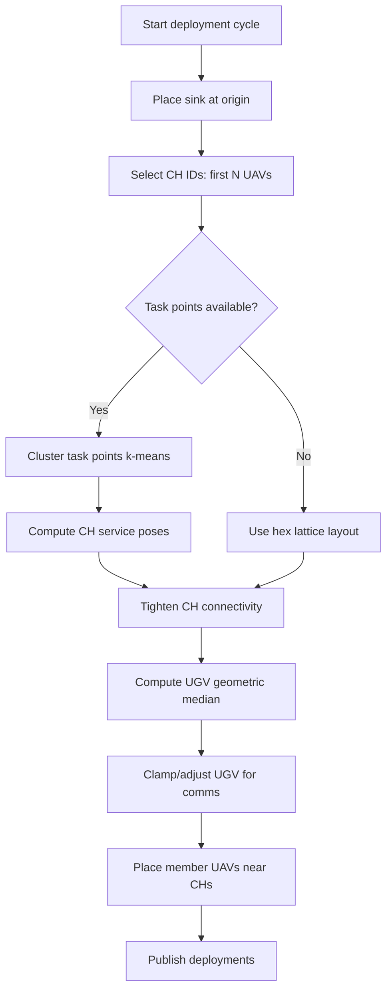
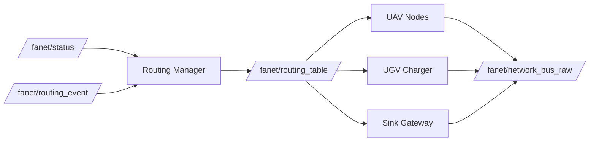
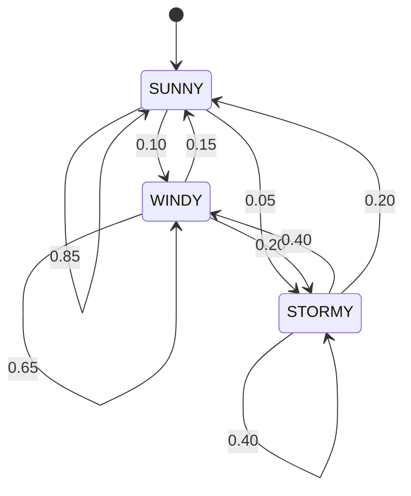

# FANET-Based UAV–UGV Cooperative Monitoring System (Flood / Disaster Scenarios)

## Overview

This project implements a **fully simulated FANET (Flying Ad‑hoc Network)** for **UAV–UGV cooperative monitoring in disaster and flood scenarios**, with a strong focus on **network robustness, routing under mobility, charging logistics, and weather‑induced failures**.

All network behavior (routing, buffering, drops, acknowledgements) is **explicitly modeled at application level**, enabling precise QoS measurement and reproducible experiments.

The project is structured to support:

* Highly mobile UAV swarms
* Dynamic network partitioning
* Store–carry–forward routing
* Energy‑aware charging via UGVs
* Weather‑driven network instability
* End‑to‑end QoS evaluation

---

## Key Concepts

### 1. FANET Network Abstraction

All packets (DATA and CONTROL) are routed through a **logical FANET bus**:

* `/fanet/network_bus_raw` – packets before impairment
* `/fanet/network_bus` – packets after fault injection
* `/fanet/delivered` – authoritative delivery events

This separation allows us to **inject failures without modifying node logic** and to **measure true end‑to‑end performance**.

---

### 2. Deployment Point Computation (Coverage Planner)

The **coverage planner** computes deployment targets for the sink, UGV, cluster heads (CHs), and member UAVs during the initial deployment cycle:

1. **Sink placement** is fixed at the origin `(0, 0)` on first deployment.
2. **CH placement** follows a task-driven layout:
   * Task points are clustered (k‑means style) into `num_ch` clusters.
   * Each cluster head target is moved toward the farthest task until all tasks fit within the CH service radius.
3. **Fallback CH layout** (if task clustering fails) uses a **hexagonal lattice** centered at the origin, with greedy assignment to nearest available lattice points.
4. **Connectivity tightening** post-processes CH targets:
   * Pulls CHs toward task anchors,
   * Ensures overlap between nearest neighbors,
   * Keeps at least one CH within comms radius of the sink,
   * Clamps positions to the configured area bounds.
5. **UGV placement** is the geometric median of CH positions (Weiszfeld-style iteration), clamped to bounds, and nudged closer if it falls outside comms range.
6. **Member placement** assigns each member UAV near its CH with a random polar offset within a bounded radius, clamped to bounds.



---


### 3. Direct Topics (Out-of-Band)

Some important signals bypass the FANET overlay:

* UAV status publication (e.g., `UavStatus`) is a direct ROS topic consumed by the UGV, monitor, and visualization tools.
* Weather updates (`WeatherStatus`) are direct ROS topics.
* Monitoring/logging topics are published directly.

---

### 4. Roles in the System

* **Member UAVs**
  Perform area scanning and generate search telemetry when reaching task points.

* **Cluster‑Head (CH) UAVs**
  Act as aggregation and relay nodes; may temporarily disconnect from the backbone.

* **UGV Charger**
  Provides charging service; charging requests and decisions are routed through the FANET.

* **Sink Gateway**
  Collects all delivered data and control packets.

---

## Routing Architecture & Logging

The FANET simulation uses **centralized, event-driven routing** that is computed by a dedicated routing manager and consumed by every network endpoint. Routing decisions are explicit, observable, and logged for traceability.

### 1. Core Routing Components

* **Routing Manager (`routing_manager_node`)**
  * Subscribes to UAV/UGV **status beacons** on `/fanet/status` and **routing events** on `/fanet/routing_event`.
  * Builds a backbone graph of **cluster heads (CHs)** and assigns non-CH endpoints to the nearest reachable CH gateway.
  * Runs Dijkstra on the CH backbone to compute **next-hop tables** for every active node.
  * Publishes a full **routing table** per node on `/fanet/routing_table`, including next hops for CH-to-CH, CH-to-endpoint, and endpoint-to-CH gateway traffic.
  * Uses hysteresis and CH-movement thresholds to avoid route flapping, and periodically recomputes routes even without events.

* **Coverage Planner**
  * Computes the **initial deployment** and bootstraps **CH routes to the sink and UGV** via `UavDeployment` messages (direct if in range, otherwise via CH backbone).
  * Recomputes CH backbone routes when CHs change `backbone_active` state, and republishes deployment messages with updated next hops.

* **Network Endpoints (UAVs, Sink Gateway, UGV Charger)**
  * Subscribe to `/fanet/routing_table` and **cache per-node next hops** for control and data traffic.
  * Resolve the next hop locally before transmitting traffic on `/fanet/network_bus_raw`.

### 2. Routing Data Flow



### 3. Routing Logging & Eventing

* **Routing manager logs** every computed route (`[routing] src -> dst via next_hop`) for traceability.
* **Endpoints publish routing events** (e.g., `NO_ROUTE_CONTROL`) to `/fanet/routing_event` whenever they detect an unreachable destination.
* These logs/events are used to trigger **event-driven recomputes** and to diagnose routing gaps during experiments.

---

## Recovery Manager & Recovery Logic

The **recovery manager** is a dedicated node (`recovery_manager_node`) that watches for
cluster failures or backbone disconnections and then issues targeted control actions to
restore connectivity and task coverage.

### 1. Inputs & Failure Detection

* **Status beacons** (`/fanet/status`) maintain per-UAV state, including CH/member roles,
  battery, and poses.
* **Heartbeats** (`/fanet/network_bus`) are tracked per CH to detect silent disconnects.
* **Routing alerts** (`/routing_manager/alerts`) flag when the sink or UGV becomes
  unreachable.
* **Failure events** (`/uav_fleet/failure_events`) mark nodes as dead immediately.

The manager runs a **watchdog timer** that:

1. Marks CHs as dead if their status or heartbeat is stale past configured timeouts.
2. Triggers recovery if any CH timeout occurs or if the sink/UGV is flagged unreachable.
3. Enforces a cooldown between recovery epochs to avoid repeated thrashing.

### 2. Recovery Epoch Flow

When recovery triggers, the manager increments an epoch and performs:

1. **Leader election** among alive CHs using a score based on backbone degree (neighbors
   within comms range) and battery level.
2. **Cluster reassignment**: each alive member rebinds to the closest CH (battery tie‑break),
   emitting `CLUSTER_REASSIGN` control messages.
3. **Task redistribution**: tasks are re‑clustered to CHs by distance, then assigned
   round‑robin to each CH’s member set via `TASK_ASSIGN` messages.
4. **Backbone bridging** (if sink/UGV unreachable): issues `NEW_DEPLOYMENT` commands to move
   one or two CHs closer to the sink and/or UGV while preserving at least one CH‑to‑CH link
   within comms range.
5. **Recovery start/done broadcasts**: `RECOVERY_START`/`RECOVERY_DONE` messages mark the
   epoch boundaries for monitoring and logging.

### 3. Reliability of Control Actions

Recovery control packets (cluster reassignments, task assignments, new deployments) are sent
with **ACK tracking**: each message is retried on a timer up to a configurable max retry
count, and ACKs remove them from the pending queue.

---

## Charging Protocol Evaluation

Charging is treated as a **networked control problem**:

* `ChargeRequest` and `ChargeDecision` packets are routed like any other traffic
* Decisions may be delayed, dropped, or arrive too late
* Charging success depends on **both network QoS and energy state**

### Charging Policies & Queue Selection

Charging requests are enqueued by the UGV charger, and the scheduler selects the next UAV
whenever a dock spot is available. The policy is configured via `charging_policy`
(default: `fcfs`), and the selected policy determines **which queue index is chosen**.

Supported policies:

* **FCFS (`fcfs`)** – first‑come, first‑served; always selects the front of the queue.
* **Role priority (`role_priority`)** – prioritizes cluster heads (CHs) first; if no CH
  is waiting, falls back to the earliest request.
* **Earliest‑deadline‑first (`edf`)** – estimates time‑to‑empty (battery ÷ drain rate,
  using separate drains for CH vs member) and selects the smallest estimate.
* **Dynamic score (`dynamic_score`)** – computes a weighted score per entry using:
  `w_role * is_ch + w_batt * (100 − battery%) + w_wait * wait_time` and selects the
  highest score.

The queue decision is embedded in the `CHARGE_DECISION` control payload with the policy
name, queue size, rank index, and optional computed fields (`tte_sec`, `score`) so that
downstream logs can attribute why a request was selected.

The system records:

* Request acceptance / rejection
* Timeouts and drops
* Docking success
* Charging latency

This enables **direct comparison of charging policies under network stress**.

---

## Weather‑Driven Fault Injection

A dedicated **fault injector** models packet drops as a function of:

* Wind intensity
* Rain intensity
* Temperature deviation

Drops affect:

* Data traffic
* Control traffic (with configurable attenuation)

This allows controlled experiments on **network resilience under adverse environmental conditions**.

The weather node steps through a **three‑state Markov regime model** (SUNNY, WINDY, STORMY) with the following transition probabilities:



---

## Architecture

```
+-------------------+
| Weather Node      |
+---------+---------+
          |
          v
+-------------------+       
| Fault Injector    |
+---------+---------+       
          |
          v
+-------------------+        +---------------------+
| FANET Raw Bus (In)|<------ | UAV / UGV / Sink    |
+---------+---------+        +---------------------+
          |
          v
+-------------------+        +---------------------+
| FANET Bus(Out)    |------> | UAV / UGV / Sink    |
+-------------------+        +---------------------+
                                        |
                                        v
                             +---------------------+
                             | Delivered Channel   |
                             +---------------------+
                                        |
                                        v
                             +-------------------+
                             | Network Monitor   |
                             +-------------------+
```

---

## Metrics & Logging (Step F)

The system automatically records **experiment‑ready metrics**:

### Per‑Message (`messages.csv`)

* End‑to‑end delay
* Hop count / forwarding overhead
* Delivery or drop reason
* Loop / TTL / weather drops

### Charging Events (`charge_events.csv`)

* Success vs failure
* Decision latency
* Failure causes (drop, timeout, energy)
* Decision rationale (policy, rank, TTE, score, priority)
* Decision-time network context (control PDR, delay, drop reasons)

### Charging Queue Dynamics (`charge_queue_timeseries.csv`)

* Queue length over time (overall + CH/member split)
* Active charging count and UGV dock utilization
* Mean queueing delay per role (CH vs member)

### Recovery Events (`recovery_events.csv`)

* Recovery epochs (`RECOVERY_START`, `RECOVERY_DONE`)
* Cluster reassignment actions (`CLUSTER_REASSIGN` member → CH)
* Task redistribution payload sizes (`TASK_ASSIGN` task counts)
* Backbone redeployment commands (`NEW_DEPLOYMENT` CH target poses)

### QoS Metrics (`qos_metrics.csv`)

The network monitor aggregates per‑flow QoS stats (keyed by `flow_type` + `control_type`) and
exports the values used to compute QoS:

* `generated`, `delivered`, `dropped` – total counts per category
* `pdr` – packet delivery ratio (`delivered / generated`)
* `delay_mean_ms`, `delay_p95_ms` – end‑to‑end delay mean and 95th percentile
* `jitter_ms` – mean absolute inter‑arrival delay delta
* `throughput_bps`, `generated_bps` – delivered vs generated throughput in bits/sec
* `qos_score` – weighted score derived from PDR, delay, and jitter targets

### UAV State Time Series (`status_timeseries.csv`)

* Battery level
* Charging state
* Backbone participation
* Position over time

### Run Summary (`summary.json`)

* PDR by traffic type
* Delay statistics (mean / p95)
* Drop breakdown
* Charging success rate
* Per-UAV fairness stats (rejections, timeouts, max waiting time)
* Recovery event counts (start/done, reassignments, task assigns, deployments)

All outputs are written to:

```
<output_dir>/<run_id>/
```

---

## Charging Protocol Comparison Plots

Use the helper script to compare charging protocols across multiple runs. The script reads the
`charge_events.csv` files produced by the network monitor and generates side-by-side charts
for outcome distribution, queue waiting time, decision latency, energy recovered, and the
network QoS context at decision time.

```bash
python3 tools/charging_protocol_compare.py \
  --log-root log \
  --output-dir analysis/charging_protocol_comparison
```

Optional: provide a CSV mapping run IDs to protocol labels if you want to override the
`decision_policy` values stored in the logs.

```csv
run_id,protocol
run_policy_a,priority_queue
run_policy_b,greedy_tte
```

---

## System Bringup

The entire system is launched via the **`system_bringup` package**.

### Example

```bash
ros2 launch system_bringup experiment.launch.py \
  config:=system_bringup/config/runs/example_run.yaml \
  run_id:=demo_weather_high \
  output_dir:=/tmp/fanet_logs
```

---

## Reproducible Experiments

Experiments are defined via YAML files:

* Network parameters
* Weather regime
* Charging policy
* Traffic intensity
* Random seeds

This allows **batch execution and fair comparison** across scenarios.

---

## Intended Use

This project is intended for:

* Academic research
* FANET / disaster‑response simulation
* Energy‑aware networking studies

---


## License

MIT
